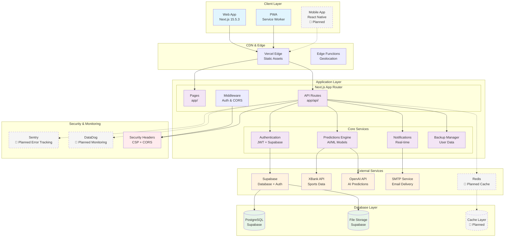
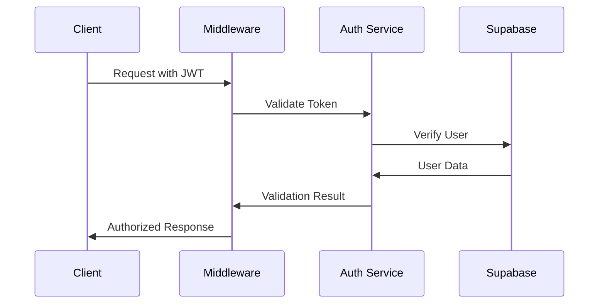

# 🏗️ Architettura Sistema - Mister Vertex

## 📊 Diagramma Architetturale



---

## 🔧 Componenti Architetturali

### **1. Client Layer**

#### **Web Application (Next.js 15.5.3)**
- **Responsabilità**: Frontend principale, SSR/SSG, routing
- **Tecnologie**: React 19, TypeScript, Tailwind CSS
- **Features**: 
  - App Router per routing moderno
  - Server Components per performance
  - Client Components per interattività
  - Responsive design mobile-first

#### **Progressive Web App (PWA)**
- **Responsabilità**: Esperienza mobile nativa
- **Features**:
  - Service Worker per caching
  - Offline functionality
  - Push notifications
  - App-like experience

#### **Mobile App (Planned)**
- **Responsabilità**: App nativa iOS/Android
- **Tecnologie**: React Native (pianificato)
- **Integrazione**: Shared API endpoints

### **2. Application Layer**

#### **Next.js App Router**
```
app/
├── (auth)/          # Auth group routes
├── admin/           # Admin dashboard
├── dashboard/       # User dashboard  
├── api/             # API endpoints
├── globals.css      # Global styles
└── layout.tsx       # Root layout
```

#### **API Routes Structure**
```
app/api/
├── auth/            # Authentication endpoints
├── predictions/     # AI predictions
├── users/           # User management
├── admin/           # Admin operations
├── notifications/   # Real-time notifications
└── health/          # Health checks
```

#### **Core Services**

**Authentication Service**
- **Input**: Credentials, JWT tokens
- **Output**: User session, permissions
- **Integrazione**: Supabase Auth + custom JWT
- **Security**: bcrypt hashing, JWT validation

**Predictions Engine**
- **Input**: Match data, user preferences
- **Output**: AI-generated predictions
- **Integrazione**: OpenAI API, XBank sports data
- **Processing**: ML models, statistical analysis

**Notifications Service**
- **Input**: User events, system triggers
- **Output**: Email, push notifications
- **Integrazione**: SMTP, browser notifications
- **Features**: Real-time updates, preferences

**Backup Manager**
- **Input**: User data, system state
- **Output**: Backup files, restore points
- **Storage**: Supabase Storage
- **Schedule**: Automated + manual triggers

### **3. External Services Integration**

#### **Supabase (Primary Backend)**
```typescript
// Client Configuration
const supabase = createClient(
  process.env.NEXT_PUBLIC_SUPABASE_URL,
process.env.NEXT_PUBLIC_SUPABASE_PUBLISHABLE_KEY
);

// Server Configuration  
const supabaseAdmin = createClient(
  process.env.NEXT_PUBLIC_SUPABASE_URL,
process.env.SUPABASE_SECRET_KEY
);
```

**Responsabilità**:
- Database PostgreSQL
- Authentication & Authorization
- File Storage
- Real-time subscriptions
- Row Level Security (RLS)

#### **XBank API (Sports Data)**
```typescript
// Sports Data Integration
interface XBankResponse {
  matches: Match[];
  odds: Odds[];
  statistics: Statistics[];
}
```

**Responsabilità**:
- Live sports data
- Match statistics
- Betting odds
- Historical data

#### **OpenAI API (AI Predictions)**
```typescript
// AI Integration
interface PredictionRequest {
  matchData: MatchData;
  historicalData: HistoricalData;
  userPreferences: UserPreferences;
}
```

**Responsabilità**:
- AI-powered predictions
- Natural language processing
- Pattern recognition
- Confidence scoring

### **4. Database Layer**

#### **PostgreSQL Schema (Supabase)**
```sql
-- Core Tables
users (id, email, role, created_at, updated_at)
predictions (id, user_id, match_id, prediction, confidence, created_at)
matches (id, home_team, away_team, date, status, result)
user_preferences (user_id, settings, notifications, created_at)
admin_logs (id, admin_id, action, details, timestamp)

-- Indexes
CREATE INDEX idx_predictions_user_id ON predictions(user_id);
CREATE INDEX idx_matches_date ON matches(date);
CREATE INDEX idx_admin_logs_timestamp ON admin_logs(timestamp);
```

#### **File Storage Structure**
```
storage/
├── avatars/         # User profile images
├── backups/         # User data backups
├── exports/         # Data exports
└── uploads/         # General file uploads
```

### **5. Security Layer**

#### **Authentication Flow**


#### **Security Headers**
```javascript
// next.config.js Security Configuration
headers: [
  {
    source: '/(.*)',
    headers: [
      { key: 'X-DNS-Prefetch-Control', value: 'on' },
      { key: 'X-XSS-Protection', value: '1; mode=block' },
      { key: 'X-Frame-Options', value: 'SAMEORIGIN' },
      { key: 'X-Content-Type-Options', value: 'nosniff' },
      { key: 'Referrer-Policy', value: 'origin-when-cross-origin' }
    ]
  }
]
```

#### **Content Security Policy**
```javascript
// Image Security
contentSecurityPolicy: "default-src 'self'; script-src 'none'; sandbox;"
```

### **6. Performance & Monitoring**

#### **Caching Strategy**
```typescript
// Next.js Caching
export const revalidate = 3600; // 1 hour
export const dynamic = 'force-dynamic'; // For real-time data

// Planned Redis Caching
interface CacheConfig {
  predictions: 300,    // 5 minutes
  matches: 600,        // 10 minutes  
  userSessions: 3600   // 1 hour
}
```

#### **Monitoring Points**
- **API Response Times**: < 200ms target
- **Database Queries**: < 100ms target
- **Error Rates**: < 1% target
- **Core Web Vitals**: LCP < 2.5s, FID < 100ms, CLS < 0.1

---

## 🔄 Data Flow Patterns

### **1. User Authentication Flow**
```
1. User Login → 2. JWT Generation → 3. Session Storage → 4. API Authorization
```

### **2. Prediction Generation Flow**
```
1. Match Selection → 2. Data Fetching (XBank) → 3. AI Processing (OpenAI) → 4. Result Storage → 5. User Notification
```

### **3. Real-time Updates Flow**
```
1. Data Change → 2. Supabase Trigger → 3. Real-time Subscription → 4. Client Update
```

### **4. Backup & Recovery Flow**
```
1. Scheduled/Manual Trigger → 2. Data Export → 3. Storage Upload → 4. Verification → 5. User Notification
```

---

## 🚀 Deployment Architecture

### **Production Environment**
```
Vercel (Frontend) → Supabase (Backend) → External APIs
```

### **Development Environment**
```
Local Next.js → Local/Remote Supabase → External APIs
```

### **Staging Environment**
```
Vercel Preview → Supabase Staging → External APIs (Test Mode)
```

---

## 🔮 Future Architecture Evolution

### **Planned Enhancements**
1. **Redis Cache Layer**: Performance optimization
2. **Microservices**: Service decomposition
3. **Mobile App**: React Native implementation
4. **Advanced Monitoring**: Sentry + DataDog integration
5. **CDN Optimization**: Global content delivery
6. **API Gateway**: Centralized API management

### **Scalability Considerations**
- **Horizontal Scaling**: Vercel auto-scaling
- **Database Scaling**: Supabase connection pooling
- **Cache Distribution**: Redis cluster
- **Load Balancing**: Vercel edge functions

---

*Ultimo aggiornamento: 2024-01-20*  
*Versione architettura: v1.0*